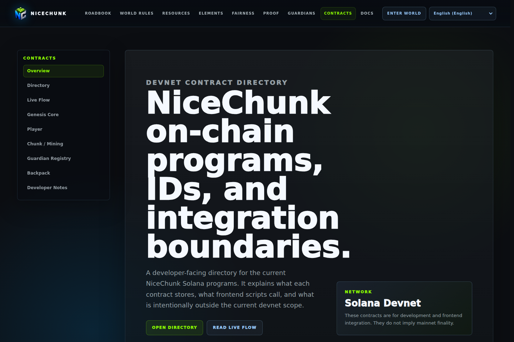
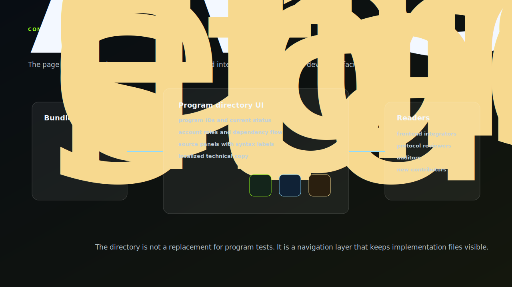
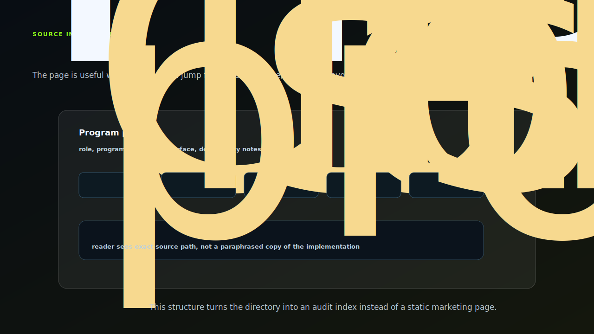

# NiceChunk Contracts

Developer-facing contract directory and source browser.

## Project Overview

This repository contains the contract directory UI for NiceChunk. It presents program IDs, PDA seeds, instruction surfaces, integration flow, and source files in a browser-readable format.

The page is not the canonical source of the programs. Instead, it acts as a documentation and inspection layer that makes the current program surface easier to understand for frontend developers, auditors, and contributors.

The contract directory is useful during active development because it keeps Rust program files, SDK files, and integration notes visible in one place.

## Directory Architecture

This project is a source browser with product-quality navigation. The page imports raw Rust files, SDK files, localized explanations, program IDs, PDA seed notes, and integration steps so readers can move from a high-level role to the exact implementation path.

That is the difference between this repository and the program repository. Programs own execution. The contract directory owns orientation: what exists, where the source lives, which SDK helper matches it, and how a frontend or auditor should start reading it.

## Source Panel Stack

Each program panel should keep implementation and integration next to each other. The reader should be able to start from a program role, jump to `lib.rs`, inspect `state.rs`, compare errors, and then open the matching SDK helper without guessing which files belong together.

This structure makes the contract directory more than a catalog. It becomes a practical audit index for the current development surface.

## System Principles

- Show real source paths: the UI references actual program and SDK files rather than paraphrasing the implementation.
- Prioritize integration boundaries: each program is described by its role, account surface, and dependency on other programs.
- Document current devnet reality: the page is explicit about development status and avoids implying mainnet finality.
- Keep copy localized through the page dictionaries while preserving technical identifiers exactly.

## How It Works

- Use the directory to locate a program, then inspect its Cargo file, cluster config, error list, instruction entrypoint, state layout, and SDK helper.
- Update the page whenever a program is added, a program ID changes, or an account layout changes.
- Use the integration flow section to explain how gameplay moves from wallet identity into player sessions, chunk state, Guardian coverage, and inventory or market operations.

## Why This Project Matters

Protocol code needs a reader-friendly surface. This repository gives developers a structured map of what exists today and how the pieces connect.

Because the page is independent from the primary game client, it can evolve as a developer portal without risking gameplay regressions.

## Repository Layout

- `contracts/`
- `programs/`
- `sdk/`
- `src/site-ui.js`

## Development Workflow

1. Clone the repository and inspect the focused source tree before changing shared contracts or generated artifacts.
2. Keep changes scoped to the domain of this repository. Cross-domain changes should be coordinated through the matching split repositories.
3. Run the smallest meaningful validation for the touched surface: build checks for programs, browser checks for pages, or fixture checks for deterministic libraries.
4. Update screenshots and documentation when behavior, visible UI, public constants, or developer-facing workflows change.

## Future Development Direction

- Generate source listings from tagged program releases instead of manually bundled files.
- Add account layout diagrams and byte offset tables for each program.
- Track program release history and devnet/mainnet program IDs separately.
- Add deep links from each instruction to SDK examples and test fixtures.

## Maintenance Notes

This repository is a focused split from the main NiceChunk working tree. Keep the public surface explicit: avoid committing private keys, wallet files, deployment-only scripts, machine-specific configuration, or generated build artifacts. Runtime user-facing copy should stay behind the i18n layer where the project has an i18n surface.
